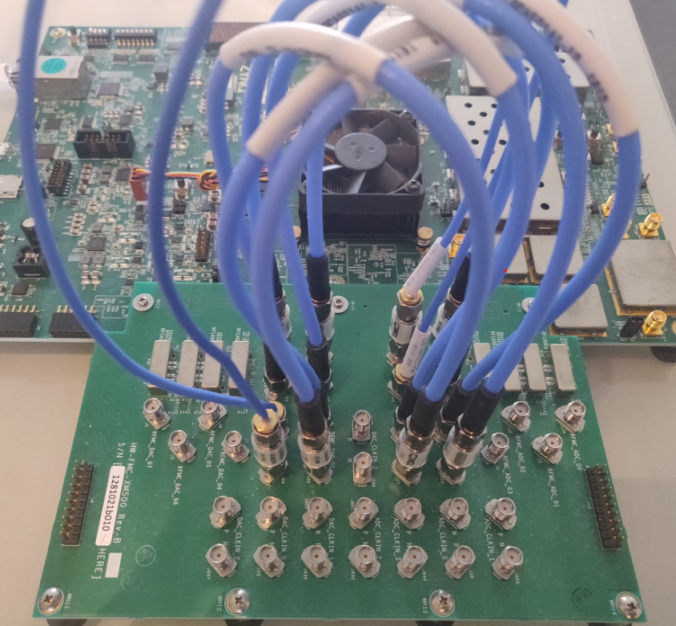

# FPGA Adaptive Beamforming with HDL Coder and Zynq RFSoC

## Overview

These models will demonstrate how to design and implement the minimum-variance
distortionless-response (MVDR) adaptive beamforming algorithm on the Xilinx®
Zynq UltraScale+™ RFSoC platform. By following a Model-Based Design strategy, 
we show how the MVDR beamformer can be articulated in MATLAB, Simulink, 
Fixed-Point and HDL. We further demonstrate a prototyping workflow by deploying
the beamformer to the ZCU111 RFSoC evaluation board for run-time testing, 
debugging and visualization.

## MVDR Demo Files

### mvdr_hdl_sim ###

This model uses the phased array toolbox to demonstrate high-level modeling 
of adaptive beamforming processing. Comparisons are made to various elaborated 
versions of the same design starting originally in floating point then
to eventual fixed-point HDL. Blocks from the fixed-point toolbox were used 
to aid in this design for computing the adaptive weights using QR decomposition.

Two examples for 4x4 and 16x16 MVDR matrix solves have been provided.

### zcu111_mvdr_demo ###

This HDL model uses the same algorithm from the previous design but now integrates 
it for a ZCU111 RFSoC evaluation kit. Using 4 channels of ADC and DAC looped 
back on itself, a beam is electronically steered out the DAC and then processed
by the ADC. Using four inputs, a 4x4 covariance matrix is composed and then 
QR decomposition is applied to yield optimal steering weights that augment the 
desired steering angle. A QPSK signal of interest is resolved in the presence of 
interference which is artificially introduced in the transmit signal.

##### Required software #####

Xilinx Vivado 2020.2

MATLAB R2021b with the following add-ons:
- Simulink
- HDL Coder
- Fixed-Point Designer
- DSP System Toolbox
- Communications Toolbox
- Phased Array System Toolbox
- [HDL Coder Support Package for Xilinx RFSoC Devices](https://www.mathworks.com/hardware-support/rfsoc-hdl-coder.html )

##### Run the demo #####

1. Ensure the ZCU111 board has been configured with the SD card provided by the HDL Coder RFSoC Support Package.
  See [this page](https://www.mathworks.com/help/releases/R2021b/supportpkg/xilinxrfsocdevices/ug/guided-sd-card-setup.html) for more information.

2. On the XM500 balun card, connect the differential ADC cables for the ADC Tile 2 (Channel 0 and 1) and Tile 3 (Channel 0 and 1)
to the DAC Tile 0 Channel 0 1 2 and 3. See [section below](#adcdac-loopback-wiring-details) for more details.
 
3. Power-on the board and program the prebuilt FPGA bitstream:

	`>> program_board('BitfilePath','binaries/zcu111_mvdr.bit')`

4. After the board reboots, run the setup script to configure the RF Data Converter:

	`>> setup_rfsoc`

5. Run "RFSoC_MVDR_Demo.mlapp" by right clicking on it and selecting "run" or running it from the MATLAB command prompt:

	`>> RFSoC_MVDR_Demo`

You can use this UI app to adjust the angle of arrival for the signal of interest and the interference. 
To regain stable constellation, change the "Azimuth Angle" value to the signal of interest by adjusting the slider
to the same angle. Measurements from the MVDR optimized weights are read back from the device to show the beamforming
response and how nulls are placed to minimize interference.

##### Build the demo #####

To rebuild the bitstream from scratch, follow these instructions.

1. Open "TxSteering_RxMVDR_4x4_HDL_IQ.slx"

2. Right-click on the "DUT" subsystem, then click HDL Code → HDL Workflow Advisor

3. In the HDL Workflow Advisor, right-click on step 4.3, then click "Run to selected task".
  For more details on the individual steps of HDLWFA, please see this [example](https://www.mathworks.com/help/releases/R2021b/supportpkg/xilinxrfsocdevices/ug/DACAndADCLoopbackDataCaptureExample.html).

4. Wait for the Vivado command window to show that bitstream generation has finished.

5. Run provided utility function to program the board:
  
  NOTE: You must use this to program the board instead of HDL WFA step 4.4.

   `>> program_board`

6. Proceed from step 4 in the Demo instructions.

##### ADC/DAC Loopback Wiring Details #####

To loop back the 4 DAC and ADC channels with the XM500 board you will need to make the following connections:

Because these connections are differential, you will need SMA DC Blocks.

Connection details: 
- RFMC_ADC_04 connects to RFMC_DAC_00
- RFMC_ADC_05 connects to RFMC_DAC_01
- RFMC_ADC_06 connects to RFMC_DAC_02
- RFMC_ADC_07 connects to RFMC_DAC_03 

The above names refer to labels on the XM500. Match the SMA connectors to the above physical labels of the XM500. 
Each label represents a specific tile/channel:
- ADC Tile 2 Ch0 maps to RFMC_ADC_04
- ADC Tile 2 Ch1 maps to RFMC_ADC_05
- ADC Tile 3 Ch0 maps to RFMC_ADC_06
- ADC Tile 3 Ch1 maps to RFMC_ADC_07
- DAC Tile 0 Ch0 maps to RFMC_DAC_00
- DAC Tile 0 Ch1 maps to RFMC_DAC_01
- DAC Tile 0 Ch2 maps to RFMC_DAC_02
- DAC Tile 0 Ch3 maps to RFMC_DAC_03

Note that the PN differential connections pair up such that P connects to N.

## Documentation: Background Theory of Operation ##
A PDF file "FPGA_Adaptive_Beamforming_with_HDL_Coder_and_Zynq_RFSoC.pdf" has been included.

### Introduction: Motivation and Challenges
- Applications: Radar, Comms and Wireless (5G)
- Hardware FPGA challenges

### Theory and Implementation
- Linear algebra
- QR Decomposition
- Matrix Divide

### Zynq RFSoC and HDL Coder Implementation
- MATLAB MVDR reference code
- HDL Coder implementation
- Hardware Prototyping – live demo

The license used in this contribution is the XSLA license, which is the most common license for MathWorks staff contributions.
