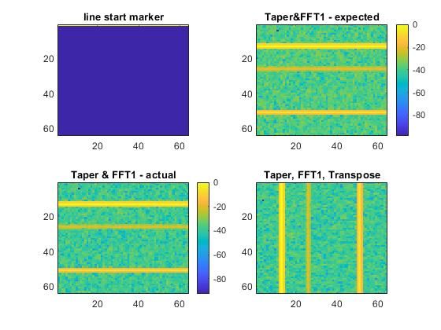

# Range-Doppler FPGA Examples

## Overview

These models demonstrate how two-dimensional transpose using external DDR4 
memory can be used for range-doppler processing for radar applications such as
range-doppler. Some examples will require SoC Blockset for memory simulation.

## Demo Files

### partA_TransposeMatrix ###

State-machine logic simulation for handling matrix transpose. Examples in these folders use SoC Blockset for simulating PL-DDR4 access and HDL Coder for deploying a matrix transpose example on the ZCU111. Incremental improvements to DDR4 corner turn memory access is shown by taking advantage of "wr-ready" and using a BRAM memory burst approach instead of bursting in one sample into memory at a time.

### partB_MatchedFilterFFTTranspose ###

Building on top of the previous example, this demo shows how a two-dimensional range-doppler processing example can be accomplished on an FPGA using HDL Coder. Similar to the previous example, this can also run on the ZCU111. BRAM Burst writes into memory are done to increase memory write throughputs.

The license used in this contribution is the XSLA license, which is the most common license for MathWorks staff contributions.
